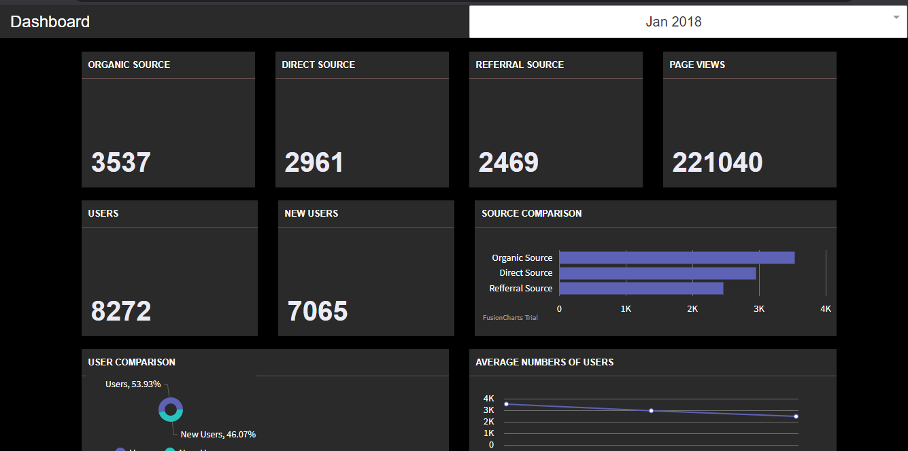
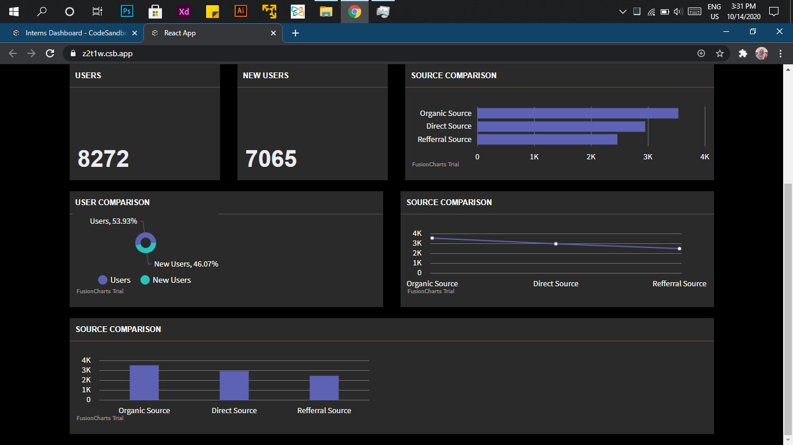

<h2> 𝐇𝐞𝐥𝐥𝐨 𝐭𝐡𝐞𝐫𝐞, 𝐟𝐞𝐥𝐥𝐨𝐰 <𝚌𝚘𝚍𝚎𝚛𝚜/>! </h2>


# Organic-Dashboard 💻
Complex components based Dashboard that take data from organic source API

## Technology 🖥
- React JS
  - Fusioncharts
  - react-bootstrtap
  - react-dropdown

## API 📎

https://docs.google.com/spreadsheets/d/1vcDPrMexD8bxNwwzK9IxF8wch6Hfezq2eooJACDiqgg/edit#gid=0
 
## Tools 🛠

| Software           	| Version 	| Reason                                                                                                                                                                                                                  	|
|--------------------	|---------	|-------------------------------------------------------------------------------------------------------------------------------------------------------------------------------------------------------------------------	|
| Windows            	| 10      	| Excellent virus protection. Full control over Windows 10. Lighter and faster operating system.<br> Possible privacy problems.                                                                                           	|
| Gitbash            	| latest  	| A shell is a terminal application used to interface with an operating system through written commands. <br>Git Bash is a package that installs Bash, some common bash utilities, and Git on a Windows operating system. 	|
| Visual Studio Code 	| 2018    	| Fast and powerful code editor for developers                                                                                                                                                                            	|

## Set up Environment🔥
Using Git Bash

``` bash
$ git clone https://github.com/wajeehamushtaq/Organic-Dashboard.git
`````
``` 
npm install
`````
or
``` 
yarn install
`````

then
``` 
npm start
`````


## Demo App 👀







## License🗝
- MIT License
